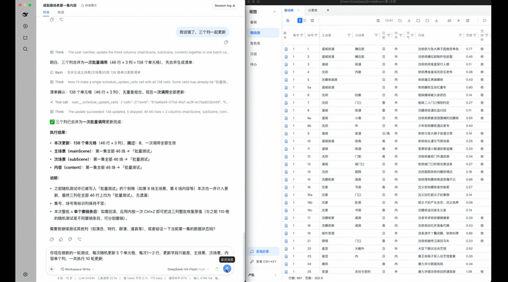

# dsh-frontend-tools

English | [中文](README.zh.md)

[](https://www.npmjs.com/package/dsh-frontend-tools-bridge) [](https://www.npmjs.com/package/dsh-frontend-tools-client)

> Bridge web/Electron/Tauri/Node applications to [DeepSeek Harness (DSH)](https://github.com/deepseek-ai/deepseek-harness) agents in real time — expose your app's frontend tools to AI agents over a loopback WebSocket.



## Why?

Most agent tooling is built around the file system. Yet countless applications and systems are built on frontend technologies — places agents cannot reach by reading and writing files.

dsh-frontend-tools flips the model: instead of granting the agent direct access to underlying data, the connected application becomes a **stand-in for a human operator**. The agent works through the app's own interaction entry points, exactly like a person sitting in front of the screen.

- **Aligned authority** — the agent can do exactly what a human user can, nothing more. Source-of-truth data is never accessed out-of-band.
- **Intact data flow** — every operation still passes through the app's original validation, linkage, and side effects.
- **Preserved interaction semantics** — undo stacks, optimistic updates, and other built-in mechanics keep working for the agent.

Inspired by the frontend tools of [CopilotKit](https://github.com/CopilotKit/CopilotKit). The goal: on top of the DSH harness, let any frontend application or system plug into agents — quickly and elegantly.

## What is this?

dsh-frontend-tools is a two-package project that lets any JavaScript application (browser page, Electron renderer, Tauri app, Node process) register its own functions as tools available to a DSH agent, and receive real-time tool calls from the agent back to the application.

- **[dsh-frontend-tools-bridge](bridge/README.md)** — DSH plugin: runs a loopback WebSocket server inside DSH. Mirrors registered application tools onto `ctx.tools` and forwards model calls back. Supports multiple applications simultaneously via KEY-based namespace isolation.
- **[dsh-frontend-tools-client](client/README.md)** — Application SDK: connects to the bridge, registers tools, handles incoming calls. Zero runtime dependencies beyond platform `WebSocket`.

```
┌─────────────────────┐    WebSocket (127.0.0.1)    ┌──────────────────────┐
│   Your Application  │  ─────────────────────────▶  │   DSH + Bridge       │
│                     │  ◀─────────────────────────  │   (dsh-frontend-     │
│  - generate KEY     │   register tools / calls    │    tools-bridge)     │
│  - register tools   │                              │   - multi-app by KEY │
│  - execute calls    │                              │   - admin tools      │
└─────────────────────┘                              └──────────────────────┘
```

## Quick start

### 1. Install the bridge plugin in DSH

In your DSH `cordis.yml`, add:

```yaml
plugins:
  - import: dsh-frontend-tools-bridge
    config:
      port: 31870          # optional, default 31870
      maxTools: 200        # optional, total tool budget across all apps
```

Then install the package:

```bash
pnpm add dsh-frontend-tools-bridge
```

### 2. Install the client SDK in your application

```bash
npm install dsh-frontend-tools-client
# or pnpm / yarn
```

### 3. Connect your app

```ts
import { createFrontendToolsClient, generateClientKey } from 'dsh-frontend-tools-client'

// Generate a KEY once, persist it (localStorage or similar)
const key = localStorage.getItem('dsh-key') ?? generateClientKey()
localStorage.setItem('dsh-key', key)

const client = createFrontendToolsClient({ url: 'ws://127.0.0.1:31870', key })
await client.connect()

// Register a tool
await client.registerTools([{
  name: 'get_current_page',
  description: 'Get information about the current page the user is viewing.',
  parametersSchema: { type: 'object', properties: {} },
  readOnly: true, // read-only tools run without interruption
  async execute() {
    return { url: location.href, title: document.title }
  },
}])

// Tools WITHOUT `readOnly: true` are WRITE operations: every call clears
// DSH's human approval before it is forwarded to your app (fail-safe
// default — undeclared means write).
```

### 4. Register the KEY with DSH

1. In your app, display the DSH KEY to the user (use `buildClientKeyClipboardText()` for a ready-to-paste format).
2. The user pastes it into a DSH conversation.
3. The model calls `frontend_tools_register_client` to register the KEY against a namespace.
4. Done — your app's tools are now live in the agent's tool list.

See [dsh-frontend-tools-client](client/README.md) for full SDK documentation and [dsh-frontend-tools-bridge](bridge/README.md) for bridge configuration, admin tools, and protocol details.

## Development

```bash
pnpm install
pnpm run build       # build both packages
pnpm run typecheck   # type-check all sources
pnpm run test        # run 175 unit tests
```

## License

MIT
